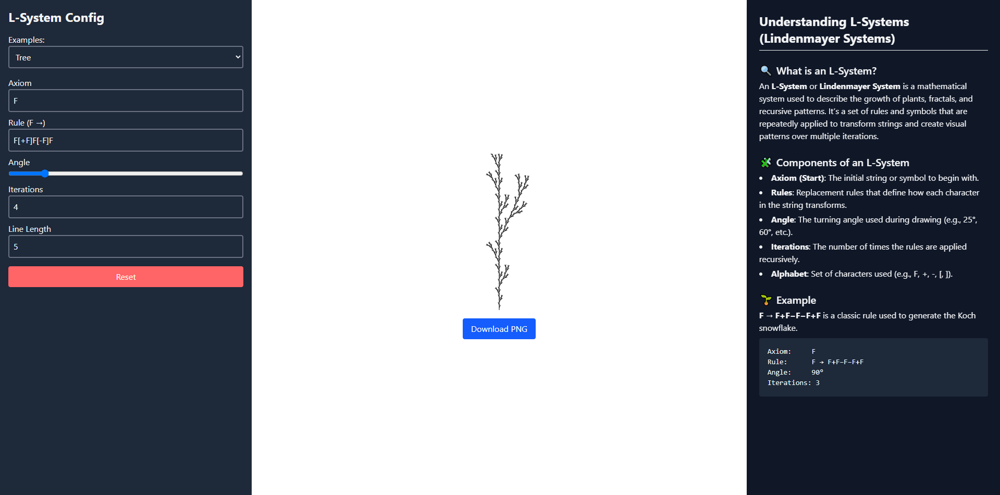
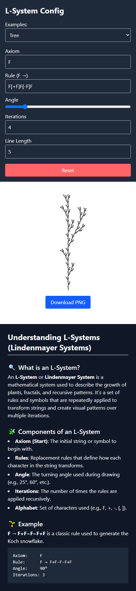

# 🌿 L-System Visualizer

A web-based visualizer for **Lindenmayer Systems (L-Systems)**, built with **React** and **Tailwind CSS**. Easily explore the recursive beauty of nature, fractals, and algorithmic art.

---

## ✨ Features

- 📐 **Dynamic Configuration**: Modify axiom, rules, angle, iterations, and line length.
- 🌳 **Preset Examples**: Try predefined visuals like Tree, Koch Curve, and Sierpinski Triangle.
- 📤 **Download Canvas**: Save your L-System artwork as PNG.
- 🧠 **Informative Help Panel**: Learn about L-systems directly in the UI.
- 📱 **Responsive**: Works on both mobile and desktop.

---

## 📸 Screenshots

### 🖥️ Desktop View



### 📱 Mobile View




---

## 🚀 Live Demo

> [L-System Visualizer](https://l-system-visualizer.netlify.app/) 

---

## 🛠️ Setup Instructions

```bash
# 1. Clone the repository
git clone https://github.com/abu-abdullah22/L-system-visualizer.git

# 2. Go into the project directory
cd L-system-visualizer

# 3. Install dependencies
npm install

# 4. Start the development server
npm run dev
Then open your browser at [http://localhost:5173](http://localhost:5173).


```
---

## 📂 Folder Structure
```bash
├── public/ # Static assets (e.g., screenshots)
├── src/
│ ├── components/ # Sidebar, CanvasRenderer, HelpPanel
│ ├── utils/ # L-System logic (generate + draw)
│ └── App.jsx # Main app component
├── index.html
├── tailwind.config.js
└── vite.config.js
```
---

## 📘 What is an L-System?

An **L-System** or **Lindenmayer System** is a recursive grammar used to simulate the growth of plants, algae, and fractals.  
It starts with a base axiom and applies transformation rules over iterations to generate complex patterns.

---

## 🤝 Contributing

Pull requests and stars are welcome!  
Feel free to open issues for bugs, features, or improvements.

---

## 📜 License

MIT License © 2025 [Md. Abu Abdullah](https://github.com/abu-abdullah22)